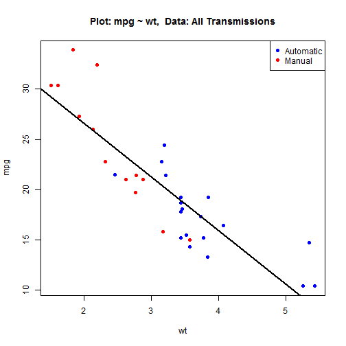

Analysis of Miles per Gallon
========================================================
author: JAVIER ORUS LACORT 
date: January, 2016
width: 1920
height: 1080

Synopsis
========================================================

We have created a Shiny Application that allows the User to investigate the 
correlation between Miles per Gallon variable **mpg** and other variables 
in the **mtcars** Dataset.

Moreover, the User has the possibility of comparing such 
correlation separately by different Transmission Types.

- The Application can be run here: https://javier-orus-lacort.shinyapps.io/PA2_SHINY_APP/

- The Code for the Application and for this RStudio Presentation can be 
revised here: https://github.com/javier-orus-lacort/DataProductsProject

Basics
========================================================

This Application is based on the **mtcars** Dataset, available in the 
**datasets** package within R.

The **mtcars** Dataset is a data frame with 32 Observations on 11 Variables, 
recapping technical information for 32 different cars. 

The Variables are:

- **mpg**: Miles per Gallon 
- **cyl**: Number of Cylinders 
- **disp**: Displacement (cu.in.)
- **hp**: Gross Horsepower
- **drat**: Rear Axle Ratio 
- **wt**: Weight (1000 lbs)
- **qsec**: 1/4 Mile Time
- **vs**: V/S
- **am**: Transmission (0=Automatic, 1=Manual)
- **gear**: Number of Forward Gears
- **carb**: Number of Carburetors


Instructions
========================================================

The User can do two selections with *Radio Button* selectors:
      

- *The variable to be used to compare with Miles per Gallon*: This variable is 
used to plot Miles per Gallon (y-axis) against this variable (x-axis) and, 
moreover, to fit and plot the Regression Line between them.

- *The Transmission Type filter to consider*: This filter is used to consider 
the whole **mtcars** Dataset, or to subset that just to only consider the cases 
having Automatic or Manual Transmission Types.

Outputs
========================================================

Based on the selections done by the User, we plot the selected data with the 
corresponding Regression Line fitted.

For instance, selecting *Variable* = **wt** and *Filter* = **All Transmissions**
we get the following plot:

 

Then, we show the Regression Line Coefficients afterwards:


```
(Intercept)          wt 
  37.285126   -5.344472 
```
